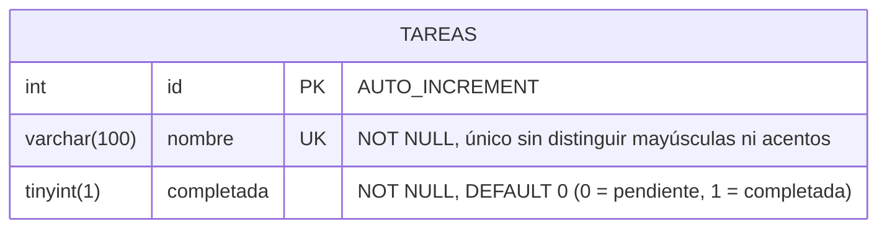

# Diagrama de entidades y relaciones – Ejercicio 2

```mermaid
erDiagram
    TAREAS {
        int id PK "AUTO_INCREMENT"
        varchar(100) nombre UK "NOT NULL, único sin distinguir mayúsculas ni acentos"
        tinyint(1) completada "NOT NULL, DEFAULT 0 (0 = pendiente, 1 = completada)"
    }
```

Hay una única tabla, por lo que no existen relaciones con otras entidades.